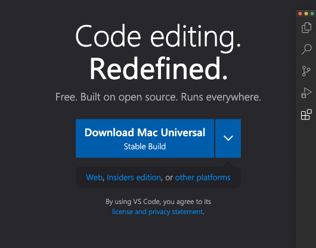

# Editing The Website

## Tools

You'll need Node.js and some kind of editor.

### Install Node

[Download](https://nodejs.org/dist/v18.15.0/node-v18.15.0.pkg)

[Website](https://nodejs.org/en/download) if you like to read things.

### Install VSCode

[Install Page](https://code.visualstudio.com/)

Click the big blue button



Open VSCode. Open `File > Open Folder`, then find where the SKIE code is, and open the `website` folder.

### Run Preview

In VSCode, go to `View > Terminal`.

In terminal, run:

```shell
npm install
```

That will take a bit.

Then run:

```shell
npm run start
```

That will run for a bit, then should open [http://localhost:3000](http://localhost:3000). That is the whole site.

### Edit Code

The home page is at `src/pages/index.tsx`. That is technically React code, but it is mostly just layout tags.

The components in the index page all live in `src/components`. Open `Overview.jsx`. Change some of the coty text, then
save the file. The content running in the browser should update in a second or two.

That's basically it. Play with it. You won't break anything, at least not on the server. Worst case, just get the code again.
